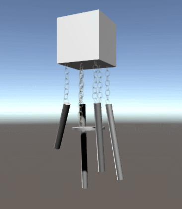

# Wind Chime Room demo

### Wind Chime mechanism Preview:

Chain models source: https://spennerino.itch.io/unitychaintutorial

### Temporary control
- *E* to open single door
- *D* to open double slide door
- *L* to open left side window
- *R* to open left side window